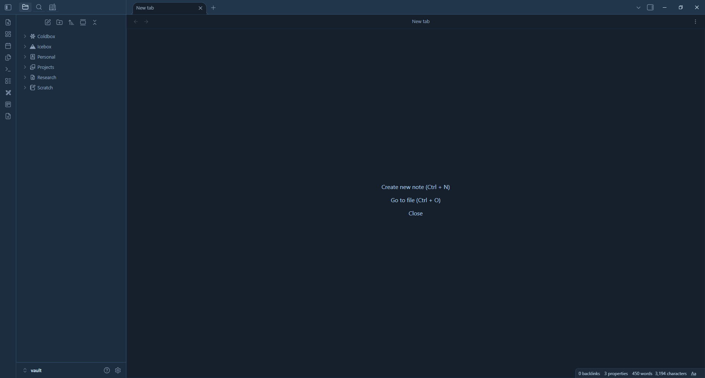

# Unsent Letters — Frozen Typewriter ❄️

A dark, icy typewriter theme for [Obsidian](https://obsidian.md), built for long writing sessions rather than screenshots.

## Design goals

Most dark themes are optimized to look good in the first five minutes, not to be stared at for an hour. This theme focuses on the details that matter during a long writing session:

- A monospace typewriter font in the editor, chosen for readability over long stretches, not for decoration
- Generous line height and paragraph spacing to prevent walls of text
- A max content width so lines don't stretch across a wide monitor
- The current line stays highlighted while the rest of the text fades slightly
- A visible cursor — a common weak point in dark themes
- A working zen mode that actually hides the ribbon, tabs, and status bar

## Features

- Dark theme with an arctic blue-black background and ice-blue accents
- Focus mode for writing, with full zen mode support
- Fully configurable from Obsidian's theme settings — colors, fonts, font size, line height, content width, and more, no CSS editing required
- File explorer with automatic color-coded root folders (12 colors, cycling automatically)
- Dedicated styling for Kanban, QuickAdd, Notebook Navigator, Banner, and Dataview
- Responsive layout that works on mobile
- Respects `prefers-reduced-motion`
- No external font loading or network calls — system fonts only

## Installation

**Manual:**
1. Download `theme.css` and `manifest.json`
2. Place both files in `.obsidian/themes/unsent-letters/` inside your vault
3. Go to Settings → Appearance → Themes → Manage, and select "Unsent Letters — Frozen Typewriter"

**Community themes:**
Search "Unsent Letters" under Settings → Appearance → Themes → Manage.

## Customization

Open Settings → Appearance → Themes, then click the gear icon next to the theme. All colors, fonts, font size, line height, content width, border radius, and transition speed — along with the file explorer's folder colors — can be adjusted from the UI, no code required.

## Compatibility

- Requires Obsidian 1.6.0 or later
- Dark mode only; a light variant is not currently planned
- Tested primarily on desktop; mobile layout is supported but less extensively tested

## Contributing

Found a visual bug with a plugin not listed above? Open an issue with a screenshot and the plugin name.

## License

MIT — see [LICENSE](LICENSE).
