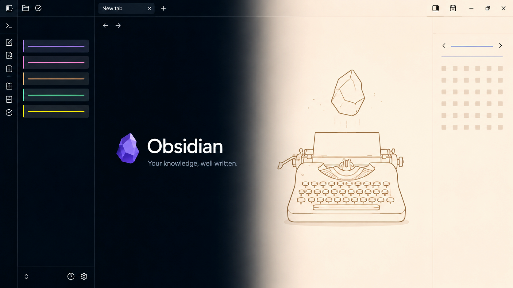

# Unsent Letters — Frozen Typewriter ❄️

A dark, icy typewriter theme for [Obsidian](https://obsidian.md).

## Why I made this

I write at night, long sessions, and I got tired of themes that look great in the first screenshot and wear on your eyes twenty minutes in. I wanted something built for staring at, not for looking good in a tweet.

So most of the work went into small things that only matter after the first hour. A monospace typewriter font in the editor, generous line height, a max content width so lines don't stretch across a wide monitor. The line you're on stays sharp while the rest of the paragraph dims and blurs slightly, so your eyes always know where you left off. The cursor doesn't just blink on and off — it breathes, a smooth fade instead of a hard flicker, so it reads as alive instead of a dead line sitting on the page.

I also wired up typewriter scrolling: the active line stays vertically centered in the pane, like a physical typewriter carriage, so the page moves instead of your eyes. And there's a very faint paper-grain texture over the editor — almost invisible, just enough that it doesn't feel like staring at a bare screen.

## Little things for actual drafting

A few details came from writing fiction specifically, not just "text":

- **Dialogue gets tinted.** Anything in quotes picks up a warm highlight color so spoken lines are scannable at a glance while you're revising.
- **Draft comments stand apart.** Obsidian's `%% comment %%` syntax gets its own quiet color and background, so notes-to-self read as clearly separate from the manuscript.
- Both are configurable colors, in case the defaults don't fit your palette.

## Two palettes, fully configurable

Dark is an arctic blue-black with ice-blue accents — the one I actually use. There's also a light palette with a warmer tone (pink, gold, wine) for when the sun's on the screen and dark mode turns into a mirror.

Everything that matters is exposed in Obsidian's theme settings — background, accent, fonts, font size, line height, content width, border radius, transition speed, even the focus-mode dim/blur amount and the dialogue/comment colors — no CSS editing required. I built it that way because I'm the kind of person who keeps tweaking these numbers depending on the project.

## Focus mode and zen mode

Focus mode dims and slightly blurs every line except the one you're on. Zen mode goes further and actually hides the tab bar, the ribbon, and the status bar — not just visually collapsed, gone — so there's nothing but the page.

## The rest

- Styled callouts, tags, tables, code blocks, blockquotes, buttons, modals, and the search/quick-switcher popup, so the whole app feels consistent, not just the editor
- A quiet, single-accent file explorer — hover and active states use the same accent color as the rest of the theme, nothing flashy
- Respects `prefers-reduced-motion` — animations and the breathing cursor turn off
- Responsive on mobile — smaller base font size, full-width content below 768px
- No external font loading, no `@import`, no network calls — system and bundled font stacks only

## License

MIT — see [LICENSE](LICENSE).
